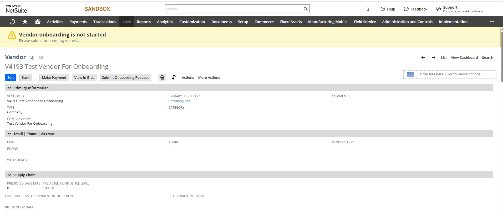
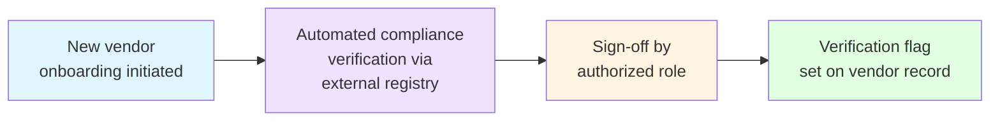

# Vendor Onboarding & Compliance Verification

NetSuite ships strong vendor management — but no vendor onboarding workflow. Procurement teams reinvent the same pattern in spreadsheets, email threads, and ad-hoc approvals, losing audit trail and inviting compliance gaps.

This is what I built to close that gap inside NetSuite itself.

## The problem

A new vendor arrives. Before that vendor can transact, the business needs to confirm: is this a real registered entity, not a sanctioned party, not a shell, with the financial standing to do business? This is **vendor due diligence** — boring, repetitive, and badly served by the tools most NetSuite installations use.

Common failure modes:

- Compliance check happens in spreadsheets, emails, or someone's head
- Approval authority isn't enforced — anyone with vendor edit rights can mark a vendor operational
- No audit trail for *who verified, when, against what source*
- Re-verification is forgotten until a regulator notices

## What this does

An automated due-diligence pipeline, surfaced directly inside the Vendor record:

The compliance check runs as a Workato recipe: it polls NetSuite for pending requests, queries the subscribed compliance registry, writes the result back to the request, and adds to the audit log. An authorized role then approves the request for control purposes — sign-off captured on the record. Finally, a verification flag is set on the vendor; downstream processes can read it, while existing vendor-activation mechanics remain unchanged.

## Honest scope

This is a **reference implementation**, not a turnkey product.

The compliance step calls SEC EDGAR — chosen because it's free and public. EDGAR only covers US-listed public companies, so most real vendors fall to manual review. The Pass branch was exercised with stub data during development to confirm the field-mapping and audit-log formula work correctly. A real deployment substitutes the customer's actual compliance provider — Refinitiv, Comply Advantage, OFAC trade.gov, Companies House, GLEIF — by updating one HTTP step. Everything else is provider-agnostic.

Other deliberate omissions are listed under [Before deployment](#before-deployment) and [Roadmap](#roadmap).

## Architecture

- **Vendor record.** Verification state surfaces inline — a contextual banner shows current status, and a single action button leads to the next step in the process: open a new onboarding request, or view the existing one.
- **Onboarding request lifecycle.** A custom record holds the request data; a SuiteFlow state machine governs the lifecycle — Draft → Compliance Check → Manager Approval → Approved / Rejected. Transitions happen through user actions and through compliance-result writes from the integration layer. Final approval automatically propagates the verification status back to the vendor.
- **External integration.** A Workato recipe runs on a daily cadence, picks up requests awaiting compliance review, queries the external compliance registry, writes results back to NetSuite via SOAP, and maintains an audit log. Branch logic in the recipe routes results to Pass or Manual Review outcomes.

Full state machine, sequence diagrams, and per-component reference: [docs/architecture.md](docs/architecture.md). Workato recipe is illustrated as a flowchart in architecture docs; for connecting Workato to NetSuite see the [official Workato NetSuite connector docs](https://docs.workato.com/connectors/netsuite.html).

## Tech

NetSuite (SuiteScript 2.1, SuiteFlow, SDF) — Workato (NetSuite SOAP, HTTP, REST) — external compliance API (illustrative: SEC EDGAR).

## Before deployment

Required changes to move this from reference implementation to a production install:

- **Compliance provider.** Replace SEC EDGAR with the customer's subscribed provider in the Workato recipe.
- **Approver role.** Replace the Administrator restriction on Approve / Reject buttons with the procurement role used in the target account.

## Roadmap

Planned improvements after the production rollout:

- **Real-time triggering.** Replace daily polling with a webhook pushed from NetSuite on state entry into Pending Compliance Check.
- **Stale-request escalation.** Scheduled job to flag requests stuck in pending states and alert the owner.
- **Periodic re-verification.** Scheduled job to re-enqueue vendors whose verification has aged out.

## Setup

This is source code and SDF objects, not a deployable bundle. To replicate in your own NetSuite account:

1. Place SDF XML from [`src/Objects/`](src/Objects/) and JS from [`src/FileCabinet/SuiteScripts/VendorOnboarding/`](src/FileCabinet/SuiteScripts/VendorOnboarding/) into your own account-customization SDF project.
2. Deploy via `suitecloud project:deploy`.
3. Set up a TBA integration record and access token for Workato. The role on the token needs Custom Record Types, Custom Lists, Custom Fields (Setup tab, Edit), Full on the custom record, and SOAP Web Services.
4. Build the Workato recipe in your workspace following the [recipe layout](docs/architecture.md#workato-recipe). Connecting Workato to NetSuite via TBA is covered by the [official Workato NetSuite connector docs](https://docs.workato.com/connectors/netsuite.html). Replace the SEC EDGAR HTTP step with your actual compliance provider.