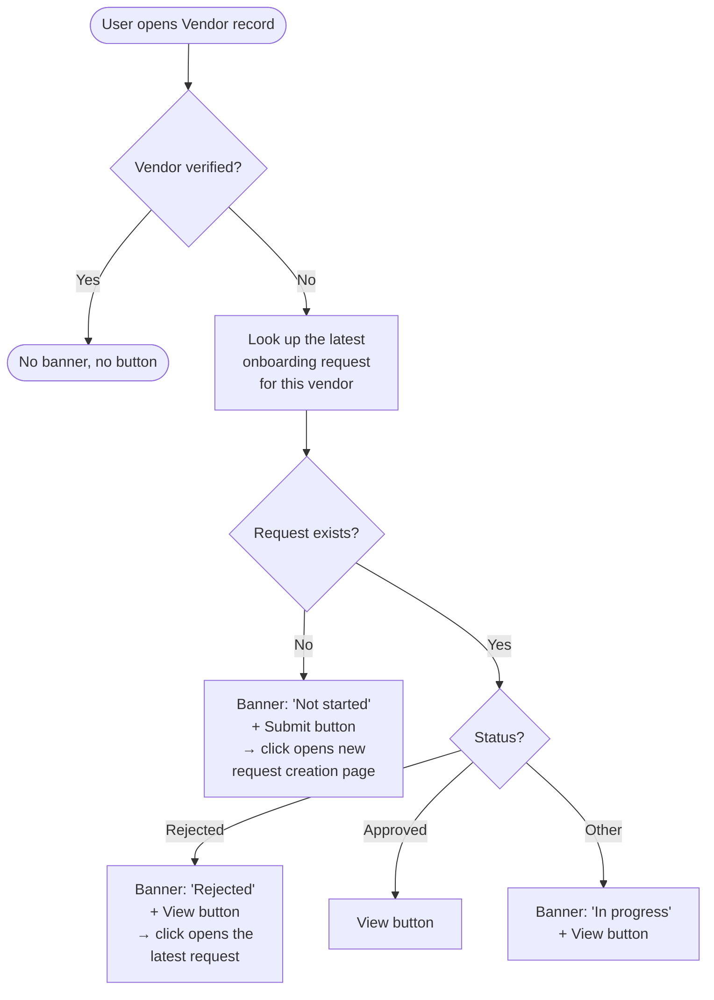
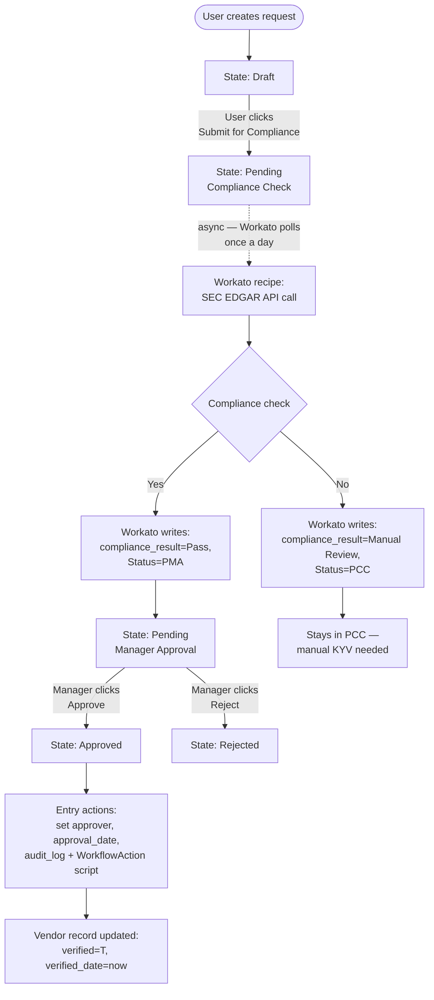
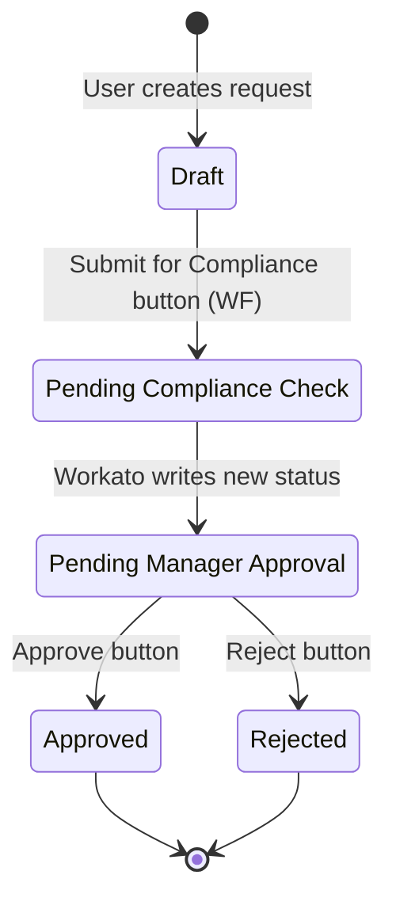
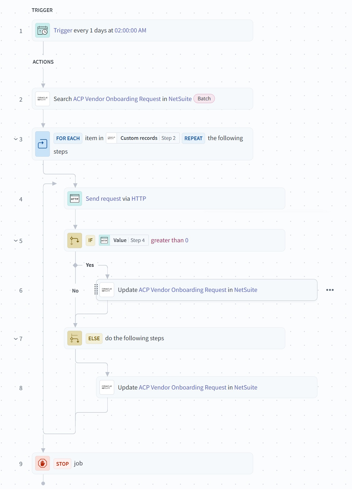

# Architecture

The system has two largely-independent flows that meet at the `customrecord_acp_vonb_request` record:

- **UI flow** — what a user sees when opening a Vendor record (driven by the UE script)
- **Request lifecycle** — what happens to an onboarding request from creation through approval (driven by SuiteFlow, Workato, and the WorkflowAction script)

Splitting them keeps each diagram tractable.

## UI flow — Vendor record banner & button

When a user opens a Vendor record, the User Event script decides what banner and button to show based on the vendor's verification state and any existing onboarding request.

## Request lifecycle — from creation to approval

Once submitted, the request flows through a state machine. State transitions are driven by three actors: the user (button clicks), Workato (field writes), and the WorkflowAction script (cross-record updates on Approved entry). The diagram below is **time-decoupled** — the Workato block runs on a daily schedule, not synchronously after submission.

Dashed arrow = asynchronous (Workato polling, not a sequential user action).

## State machine

For Manual Review case, the request stays in Pending Compliance Check with `compliance_result = Manual Review` — Workato's filter condition `Status = PCC AND compliance_result IS NULL` prevents re-processing.

## SuiteFlow workflow internals

### States and actions

| State                    | Buttons added         | Entry actions         |
| ------------------------ | --------------------- | --------------------- |
| Draft                    | Submit for Compliance | —                     |
| Pending Compliance Check | —                     | Set Status = PCC      |
| Pending Manager Approval | Approve, Reject       | —                     |
| Approved (terminal)      | —                     | 5 actions, see below  |
| Rejected (terminal)      | —                     | Set Status = Rejected |

### Approved entry actions — order of execution

1. Set Field Value: `Status = Approved`
2. Set Field Value: `approver = {user}` 
3. Set Field Value: `approval_date = TODAY`
4. **Custom action:** invoke WorkflowAction script `customscript_acpvendoronboardingwf` — propagates verification to Vendor record
5. Set Field Value: `audit_log` 

### Transitions

| From  | To       | Trigger                                   | Condition                               |
| ----- | -------- | ----------------------------------------- | --------------------------------------- |
| Draft | PCC      | Execute on Button = Submit for Compliance | —                                       |
| PCC   | PMA      | After Record Submit                       | Status field = Pending Manager Approval |
| PMA   | Approved | Execute on Button = Approve               | —                                       |
| PMA   | Rejected | Execute on Button = Reject                | —                                       |
|       |          |                                           |                                         |

## Workato recipe

